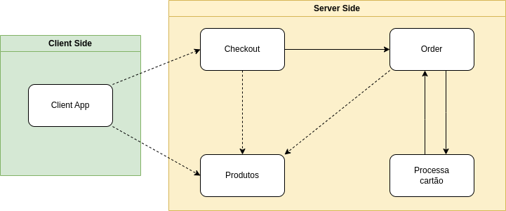

# Payment Microservices
Projeto de aprendizado de microserviços, baseado no [Intensivão Microsserviços da FullCycle](https://www.youtube.com/playlist?list=PL5aY_NrL1rjuzBYy1Gro6IVDF1BPkPK_m), que tem como objetivo ter varias APIs comunicando entre sí,  mensageria, orquestrador e Service Mesh. 
___
## Tecnologias
Diferente do projeto original, que foi feito em Golang, todas as aplicações foram feitas usando a versão 6 do .NET. As APIs são feitas em ASP.NET e o client-app é um MVC em ASP.NET. 
Será usado o Kubernetes para orquestrar os serviços, RabbitMQ para mensageria e o Istio para Service Mesh.



___
## Serviços

### client-app(MVC)
Parte front-end que se comunica com as APIs.

### produto-api
Consulta o "banco de dados", retornando todos os produtos, ou o especificado pelo uuid.

```sh
GET http://localhost:5034/api/v1/Produto

GET http://localhost:5034/api/v1/Produto/{uuid-do-produto}
```

### checkout-api
Consome as mensagens postada pelo **client-app** com as informações do usuário e o uuid do produto, checa o produto com **produto-api**, "valida" as informações do usuário e postar na fila para o **order-api** consumir.

```sh
# Post feito pelo serviço MessageConsumer, para dar inicio ao processo.
POST http://localhost:5221/api/v1/Checkout
Content-Type: application/json

{
    "ProdutoUuid":"7d3af8b1-3755-4772-8f8d-72e25b1abefa",
    "UsuarioNome":"daniel",
    "UsuarioEmail":"daniel@gmail.com",
    "UsuarioTelefone":"11 2222-4444"
}

# Post final, após as informações serem validadas, é criada a mensagem para o RabbitMQ.
POST http://localhost:5221/api/v1/MessageProducer
Content-Type: application/json

{
    "ProdutoUuid":"7d3af8b1-3755-4772-8f8d-72e25b1abefa",
    "UsuarioNome":"daniel",
    "UsuarioEmail":"daniel@gmail.com",
    "UsuarioTelefone":"11 2222-4444",
    "CreatedAt":"2023-07-26T17:15:03.1714833-03:00"
}
```
### order-api
Consome as mensagens postada pelo **checkout-api** e do **process-card-api**, adiciona a key **PedidoStatus** e dependendo do status, envia a mensagem para o **process-card-api** ou encerra o processo

```sh
# Post feito pelo serviço MessageConsumer, para dar inicio ao processo.
POST http://localhost:5075/api/v1/Order
Content-Type: application/json

{
   "ProdutoUuid":"7d3af8b1-3755-4772-8f8d-72e25b1abefa",
   "UsuarioNome":"daniel",
   "UsuarioEmail":"daniel@gmail.com",
   "UsuarioTelefone":"11 2222-4444",
   "CreatedAt":"2023-07-28T18:08:55.8822567-03:00"
}

# Como o status está pendente, ele será postado na exchange de order para ser consumido pelo processCard-api.
# Esse processo acontece com os pedidos de status "Pendente" e "Reprovado". 
POST http://localhost:5075/api/v1/Order
Content-Type: application/json

{
   "PedidoUuid":"696fc8d9-6317-4be2-9bca-3f9048338ed1",
   "PedidoStatus":"Pendente",
   "ProdutoUuid":"7d3af8b1-3755-4772-8f8d-72e25b1abefa",
   "ProdutoPreco":7.89,
   "UsuarioNome":"daniel",
   "UsuarioEmail":"daniel@gmail.com",
   "UsuarioTelefone":"11 2222-4444",
   "CreatedAt":"2023-07-28T18:08:55.8822567-03:00",
   "UpdatedAt":"2023-08-02T16:45:36.8110066-03:00"
}
```

### process-card-api
Simula uma confirmação de pagamento de cartão de credito, vai alterar o status para "Aprovado" ou "Rejeitado".

___
## Responsabilidades Detalhadas
### client-app
- Fornece uma interface para o usuário visualizar os produtos.
- Fornece uma interface para o usuário realizar o pedido.
- Posta na exchange **checkout_ex** o pedido finalizado.
    - Exemplo dos dados:
        - ProdutoUuid
        - UsuarioNome
        - UsuarioEmail
        - UsuarioTelefone

- (**Não Implementado**) Fornecer meios do usuário consultar o status do pedido em uma pagina, ou com o UUID da transação, ou passando as mesmas informações do pedido(nome, email e telefone). Ao usar as informações do pedido, deve ser mostrado todos os pedidos feitos.

### produto-api
- Consulta em um "banco de dados", retornando todos os produtos, ou o especificado pelo uuid.
    - Exemplo dos dados:
        - uuid
        - product
        - price

### ckeckout-api
- Consome mensagems da fila **checkout_queue**.
- Validar o produto consultado o **produto-api** para garantir se o produto ainda é valido.
- Validação os dados do usuário(validação fake).
- Posta a mensagem na exchange **order_ex**.
    - Exemplo dos dados:
        - ProdutoUuid
        - UsuarioNome
        - UsuarioEmail
        - UsuarioTelefone
        - CreatedAt

### order-api
- Consome mensagens da fila **order_queue**. A fila **order_queue** recebe mensagem do **ckeckout-api** e do **process-card-api**.
- Adiciona o UUID do pedido se não tiver.
- Se também não tiver status, adiciona um "Pendente" e o pedido é postado na exchange **process_card_ex** para o **process-card-api** consumir.
- Se o status do pedido estiver como "Aprovado", é gravado no banco de dados e o processo é encerrado.
- Se o status do pedido estiver como "Rejeitado", algumas tentativas a mais serão feitas, e em caso de falha, o pedido será cancelado.
- Se o status do pedido estiver como "Cancelado", é gravado no banco de dados e o processo é encerrado.

### process-card-api
- Consumir mensagens da fila **processed_order_queue**.
- Altera o status da ordem de "Pendente" para "Aprovado" ,"Rejeitado" ou "Cancelado".
- Atualiza o UpdatedAt com o datetime atual.
- Posta a mensagem na exchange **order_ex**.

___
## Executando em Desenvolvimento
Para executar direto do codigo fonte, é necessario entrar em cada um dos projetos da pasta **src** e executar em ordem:

- rabbitmq
- redis
- produto-api
- checkout-api
- order-api
- process-card-api
- client-app (Por ultimo)

```sh
$ dotnet run
#ou
$ dotnet watch
```

### Executando Demonstração
A versão de produção usa o Kubernetes, mas um arquivo **docker-compose.yml** foi criado e pode ser usado para a mesma finalidade, ele vai baixar do Docker Hub as imagens dos serviços.
```sh
# A pasta docker está na raiz do projeto
$ cd docker

$ docker compose up -d
```

### Executando em Produção
Se tiver o kubernetes rodando, ou no caso o minikube já iniciado, é possivel usar o comando abaixo.
```sh
# A pasta com o yaml do Kubernetes está na raiz
# Você pode passar a pasta e o kubectl vai executar os arquivos que estão no primeiro nivel.
$ kubectl apply -f k8s
```
___
## Variáveis de Ambiente
De momento não é preciso se preocupar com isso, as variáveis de ambiente estão sendo definidas nos **appsettings.json**, mas apenas para informar:

### Como usar

No **docker-compose.yml** pode ser consultado como é atribuido, mas deixando registrado:

```sh
# No appsettings.json
...
"PRODUTO":{
    "URL": "http://localhost:5034"
  },
...
```

```sh
# Ao declarar a variável de ambiente
PRODUTO__URL=http://localhost:5034
```

