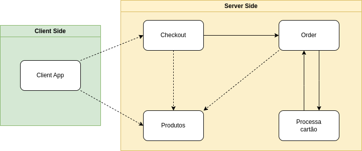

# Payment Microservices
Projeto de aprendizado de microserviços, baseado no [Intensivão Microsserviços da FullCycle](https://www.youtube.com/playlist?list=PL5aY_NrL1rjuzBYy1Gro6IVDF1BPkPK_m), que tem como objetivo ter varias APIs comunicando entre sí,  mensageria, orquestrador e Service Mesh. 
___
## Tecnologias
Diferente do projeto original, que foi feito em Golang, todas as aplicações são feitas usando a versão 6 do .NET. As APIs são feitas em ASP.NET e o client-app é um MVC em ASP.NET. 
Será usado o Kubernetes para orquestrar os serviços, RabbitMQ para mensageria e o Istio para Service Mesh.



___
## Serviços

### client-app(MVC)
Parte front-end que se comunica com as APIs.

### produto-api
Retorna do "banco de dados" todos os produtos ou um produto especifico.

```sh
GET http://localhost:5034/api/v1/Produto

GET http://localhost:5034/api/v1/Produto/{uuid-do-produto}
```

___
## Pendente

### checkout-api
Consumir uma mensagem com as informações do produto, confirmar essas informações com **produto-api** e postar na fila do **order-api**.

### order-api
Consumir a mensagem postada pelo **checkout-api**, consulta o **process-card-api(Nome temporario)** e processa a ordem.

### process-card-api(Nome temporario)
Simula uma confirmação de pagamento de cartão de credito.

___
## Responsabilidades
### client-app
- Fornece acesso ao usuário.
- Quando o usuário finalizar o pedido, os dados desse pedido devem ser postado na fila **checkout_ex**.
    - Os dados são:
        - ProdutoId
        - Nome
        - Email
        - Telefone
- Ao finalizar o pedido, exibir uma mensagem informando que o pedido está sendo processado.
- Ele postara a mensagem na fila .

### produto-api
- Consulta em um "banco de dados", retornando todos os produtos, ou o especificado pelo uuid.

### ckeckout-api
- Ao consumir uma mensagem da fila **checkout_ex**, consulta o **produto-api** usando o ProdutoId.
- Coleta os dados do pedido.
- Após consultar, ele postara a mensagem na fila **order_ex**, com as informações do produto.
    - Os dados são:
        - ProdutoId
        - ProdutoNome
        - ProdutoPreco
        - UsuarioNome
        - UsuarioEmail
        - UsuarioTelefone
        - Status(por padrão vai ser "Pendente")
        - CreatedAt (Usar o que já vem)
        - UpdatedAt (no começo vai ser nulo)

### order-api
- Ao consumir uma mensagem da fila **order_ex**, postar mensagem em **process_card_ex** para ser consumida pelo **process-card-api**
- Ao consumir uma mensagem da fila **processed_order_ex**, esse pedido será gravado no banco de dados, com isso finalizando o processo.

### process-card-api
- Ao consumir uma mensagem, altera seu status de "Pendente" para "Aprovado", e posta a mensagem novamente para o **order-api** finalizar o processo ao todo.
- Ele postara a mensagem na fila **processed_order_ex**.
- Ao alterar o status, o campo UpdatedAt também deve ser preenchido com o datetime

___
## Executando(Dev)
Para executar o projeto, é necessario entrar em cada um dos projetos da pasta **src** e executar em ordem:

- 1º. produto-api
- 2º. client-app (Por ultimo)
```sh
$ dotnet run
#ou
$ dotnet watch
```

___
## Variaveis de Ambiente
De momento não é preciso se preocupar com isso, as variaveis de ambiente estão sendo definidas nos **appsettings.json**, mas apenas para deixar anotado.

### client-app

- PRODUTO_API - Endereço do serviço produto-api
```sh
# Exemplo
PRODUTO_API=http://localhost:5034
```
- API_VERSION - Versão da API, no momento está a v1
```sh
# Exemplo
API_VERSION=v1
```